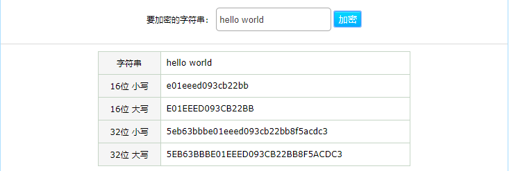
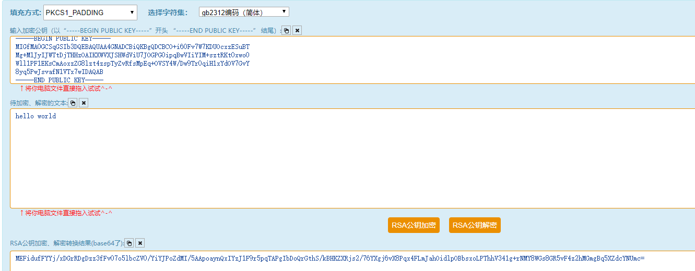
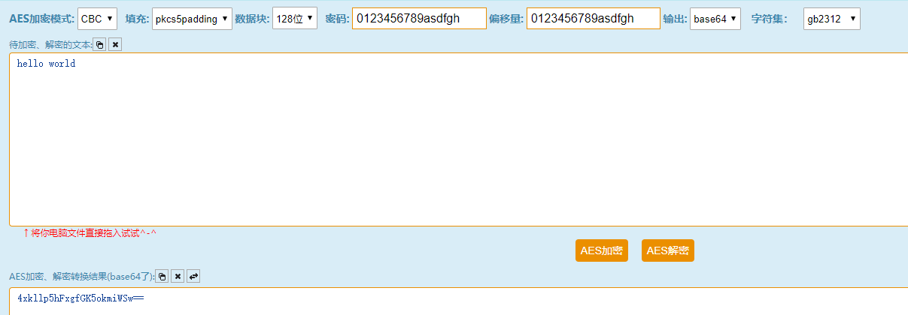
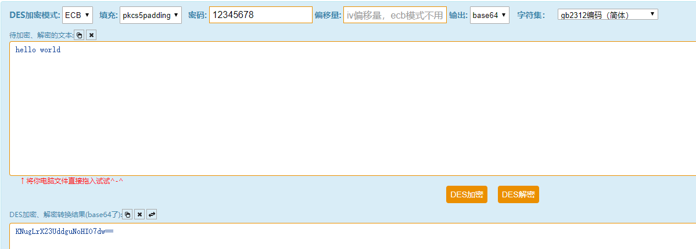
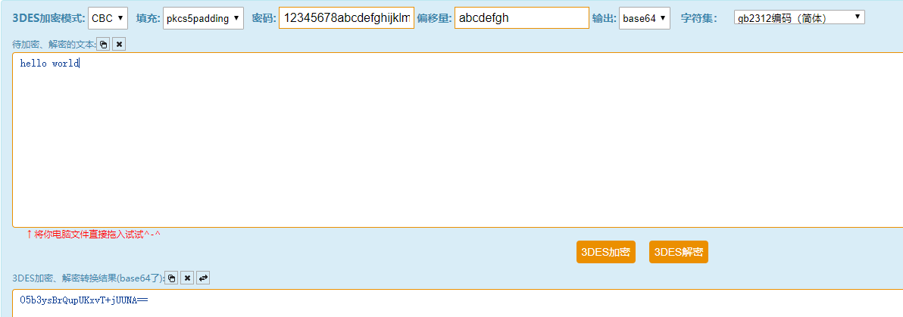
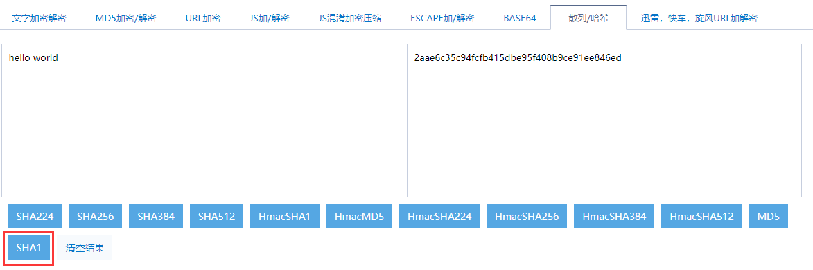

# goencrypt

Goencrypt is a library written in pure Go providing a set of encryption algorithms, which including symmetric ciphers(DES, 3DES, AES), asymmetric ciphers (RSA), etc.

## Quick Start

Download and install

```bash
go get github.com/marspere/goencrypt@v1.0.6
```

```bash
# assume the following codes in example.go file
$ cat example.go
```

```
package main

import (
	"fmt"

	"github.com/marspere/goencrypt"
)

func main() {
	value, err := goencrypt.MD5("hello world")
	if err != nil {
		fmt.Println(err)
		return
	}
	fmt.Println(value)
	// output: 5eb63bbbe01eeed093cb22bb8f5acdc3
}
```

```bash
# run example.go
$ go run example.go
```

## API Examples

You can find a number of examples at goencrypt repository.

### MD5 Message-Digest Algorithm

It is a widely used cryptographic hash function that produces a hash value to ensure complete and consistent information transfer.

```
func main() {	
    // The return value is 32-bit lowercase.
    value, err := goencrypt.MD5("hello world")
    fmt.Println(value.Value)
    
    // UpperCase32 return 32-bit uppercase value.
    fmt.Println(value.UpperCase32)
    
    // LowerCase16 return 16-bit lowercase value.
    fmt.Println(value.LowerCase16)
    
    // UpperCase16 return 16-bit uppercase value.
    fmt.Println(value.UpperCase16)
}
```


### RSA Algorithm

RSA encryption algorithm is an asymmetric encryption algorithm. RSA is also a packet encryption algorithm, except that the packet size can be changed according to the size of the key.

RSA encryption limits the length of plaintext, and specifies the maximum length of plaintext to be encrypted = len(key) - 11.

```gotemplate
func main() {
	cipher := goencrypt.NewRSACipher(goencrypt.PrintBase64, defaultPublicFile, defaultPrivateFile)
	cipherText, err := cipher.RSAEncrypt([]byte("hello world"))
	if err != nil {
		fmt.Println(err)
		return
	}
	fmt.Println(cipherText)
}
```



### AES Algorithm

AES, Advanced Encryption Standard, also known as Rijndael encryption in cryptography, is a block encryption standard adopted by the US federal government.

AES block length is fixed at 128 bits, the key length can be 128, 192 or 256 bits. It including AES-ECB,AES-CBC,AES-CTR,AES-OFB,AES-CFB.

```gotemplate
func main() {
	cipher, err := goencrypt.NewAESCipher([]byte("0123456789asdfgh"), []byte("0123456789asdfgh"), goencrypt.CBCMode, goencrypt.Pkcs7, goencrypt.PrintBase64)
	if err != nil {
    	fmt.Println(err)
    	return
    }
	cipherText, err := cipher.AESEncrypt([]byte("hello world"))
	if err != nil {
		fmt.Println(err)
		return
	}
	fmt.Println(cipherText)
}
```



### DES Algorithm

```gotemplate
func main() {
	cipher := goencrypt.NewDESCipher([]byte("12345678"), []byte(""), goencrypt.ECBMode, goencrypt.Pkcs5, goencrypt.PrintBase64)
	cipherText, err := cipher.DESEncrypt([]byte("hello world"))
	if err != nil {
		fmt.Println(err)
		return
	}
	fmt.Println(cipherText)
}
```



### Triple DES Algorithm

```gotemplate
func main() {
	cipher := goencrypt.NewDESCipher([]byte("12345678abcdefghijklmnop"), []byte("abcdefgh"), goencrypt.CBCMode, goencrypt.Pkcs5, goencrypt.PrintBase64)
	cipherText, err := cipher.TripleDESEncrypt([]byte("hello world"))
	if err != nil {
		fmt.Println(err)
		return
	}
	fmt.Println(cipherText)
}
```



### Secure Hash Algorithm

```gotemplate
func main() {
	result, err := goencrypt.SHA(goencrypt.SHA1, []byte("hello world"), goencrypt.PrintHex)
	if err != nil {
		fmt.Println(err)
		return
	}
	fmt.Println(result)
}
```



## Contributing

If you’d like to propose a change please ensure the following:

- All existing tests are passing.
- There are tests in the test suite that cover the changes you’re making.
- You have added documentation strings (in English) to (at least) the public functions you’ve added or modified.